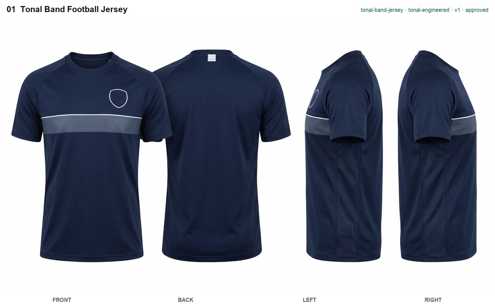
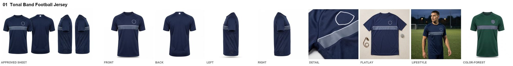

# Xelent Product Studio

Claude skills that take an apparel business from **industry research** to **approved product designs**,
**consistent photorealistic product photographs**, **product videos** and **Etsy / Alibaba.com listings submitted
as drafts**.
Built for sportswear, teamwear, streetwear, activewear, combat-sports gear, outerwear and garments in general.

It runs on [Xelent API](https://xelentapi.com) and only on Xelent API: every image and every listing goes through
your Xelent account.

## What it does

1. **Learns the industry first.** Before designing anything, Claude researches the segment from predefined source
   types (trend press, colour forecasts, category specialists, materials, marketplace demand, competitors, kit and
   design rules), writes a sourced brief, and proposes design directions. You choose the directions.
2. **Designs from the research.** Complete, makeable designs using only the decoration methods your factory runs,
   checked for balance, manufacturability and IP problems.
3. **Photographs each design consistently.** One concept sheet per product shows every view side by side; after you
   approve it, each view is generated from that sheet at the resolution you chose (2K or 4K), then detail, flat-lay, lifestyle and colourway images
   from the finished views. Size charts are typeset, never generated.
4. **Writes listings buyers find.** Alibaba titles, 15+ keyword phrases, attributes and sectioned descriptions; Etsy
   titles, 13 tags and phone-friendly descriptions, all from the research keyword bank and checked against each
   marketplace's rules.
5. **Submits safely.** Images are hosted on your Xelent dashboard; Etsy listings are created as **drafts** and
   Alibaba listings go into **Alibaba's review**. Nothing is published live. Without an Alibaba connection it
   writes Alibaba's bulk-upload spreadsheet instead.

Every stage has a gate: research approval, sheet approval, listing approval, and an explicit go-ahead to submit.

### Product videos (the `xelent-product-video` skill)

Give Claude your product photos (all the views you have) and it makes a finished video of exactly the length,
shape and resolution you ask for, on an AI model, your own model or your own mannequin photo:

- **14 video styles:** 360° turn, mannequin 360° (your mannequin photo turning in its own setting), runway walk, lookbook poses, street style, sport in action, detail close-ups, hero
  reveal, performance test, UGC try-on, team walk-out, flat lay to worn, made in our factory, colourway parade.
- **12 looks:** same as my photo, clean studio, fashion editorial, golden hour, urban street, stadium floodlights, gym grit, luxury
  dark, neon night, outdoors, phone camera at home, factory floor.
- **Any length from 5 to 60 seconds**, vertical for Reels, TikTok and Shorts or horizontal for Etsy, Alibaba and
  websites, at 768p or 1080p.

You approve a still of the model wearing your product and the first frame of every shot before any video is made
(stills cost a few credits, video costs more). Claude then animates each shot with MiniMax H3, checks every clip
frame by frame, and edits them into one MP4 with a poster frame. It tells you the cost before each step and the
credits left after. Video is priced per second:
[xelentapi.com/pricing](https://xelentapi.com/pricing).

**Example** (one original teamwear design, generated with this skill): the approved concept sheet, then every
photograph drawn from it: four studio views, a detail close-up, a flat lay, a lifestyle shot and a second colourway.




## Install

In Claude Code:

```
/plugin marketplace add Xelent143/xelent-product-studio
/plugin install xelent-product-studio@xelent-product-studio
```

Or copy `plugins/xelent-product-studio/skills/xelent-product-studio` into `~/.claude/skills/`.

Requirements: Node.js 18+, Python 3 with Pillow and openpyxl (`python3 -m pip install pillow openpyxl`).

### Claude Code on the web (claude.ai/code)

Cloud sessions do not load installed plugins. Start from the starter repository instead:
[Xelent143/xelent-product-studio-starter](https://github.com/Xelent143/xelent-product-studio-starter) >
**Use this template**. It has the skill in `.claude/skills/` and explains the two environment settings it needs
(network access **Full**, and `XELENT_API_KEY`). In a cloud session the skill shows images as links, saves progress
to the repository after every step, and `run.mjs --restore` downloads images already paid for again, free, if the
cloud machine was reset. Guide: [xelentapi.com/help/claude-code-web](https://xelentapi.com/help/claude-code-web).

## Set up Xelent API

1. Create an account at [xelentapi.com](https://xelentapi.com), add credits (one credit is one rupee) and create an API
   key under **API keys**.
2. Ask Claude to set up the product studio; it saves the key with
   `node scripts/xelent.mjs login --key sk-...` (stored in `~/.config/xelent/credentials`, readable only by you).
3. Connect your stores under **Marketplaces** on the Xelent dashboard:
   - **Etsy**: create an app at [etsy.com/developers](https://www.etsy.com/developers/register) with the callback URL
     shown on the page, then enter its keystring and shared secret.
   - **Alibaba.com**: requires a Gold Supplier store. Create an app on the
     [Alibaba.com Open Platform](https://openapi.alibaba.com/), add the callback URL shown on the page, and paste
     its App Key and App Secret (or use the platform's app when it is offered). Without a connection, the skill
     produces Alibaba's bulk-upload spreadsheet instead.
4. Every job and every credit is visible under **Job history** and **Credit ledger** in the dashboard (with CSV
   downloads), and the ledger shows whether it adds up to your balance. Claude can read the same records with
   `node scripts/xelent.mjs jobs` and `node scripts/xelent.mjs ledger`.

## Use

Ask Claude in plain words, for example:

- "Research what's trending in custom football kits and design 8 new kits for my Alibaba store."
- "Make a streetwear capsule of 5 heavyweight hoodies and tees for Etsy with product photos and listings."
- "Photograph these BJJ gi designs from every angle and list them on Etsy as drafts."

## Cost

Claude asks once which resolution you want:

| Resolution | Model | Credits (rupees) per image |
|---|---|---|
| 2K | Nano Banana 2 | 4 to 9, depending on the package your credits came from |
| 4K | GPT Image 2.5 Sunburst | 8 to 18, twice the 2K price |

A product with four views, three extras and two extra colourways is about 10 images, plus any revisions. Before
each generation stage Claude tells you how many images it will make, the credits it will use and what your balance
will be after; when the stage finishes it tells you the credits actually used and the credits left.

## Notes on marketplace rules

- The skill blocks brand, league, club, event and character names and unproven claims (certifications, waterproof
  ratings) in designs and listings.
- Etsy requires sellers to disclose AI use in creating items. The skill has a per-shop setting
  (`marketplaces.etsy.disclose_ai`, on by default) that adds a disclosure line to Etsy descriptions; if you turn it
  off, you accept Etsy's enforcement risk.

## Layout

```
plugins/xelent-product-studio/skills/xelent-product-studio/
  SKILL.md            the workflow Claude follows
  scripts/            xelent.mjs (API client) studio.py (workspace, gates) plan.py run.mjs board.py approve.py
                      size_chart.py prepare_images.py listing.py alibaba_xlsx.py publish.mjs
  references/         research playbook, design language, image direction, Alibaba and Etsy listing guides,
                      IP rules, studio.json schema, Xelent API
  evals/evals.json    test prompts
plugins/xelent-product-studio/skills/xelent-product-video/
  SKILL.md            questions, stills, clips, checks and the final edit
  scripts/            video.py (brief, plan, prompts, strips, edit) render.mjs (runs jobs, quotes, credits)
                      xelent.mjs (the same API client)
  references/         styles.json (styles and shots) looks.json styles-guide.md brief.template.json
```

## License

MIT
